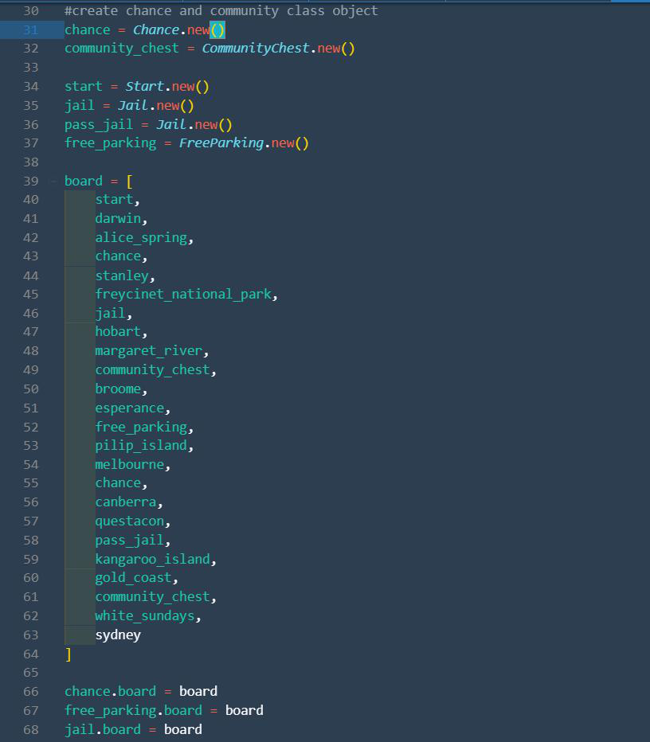
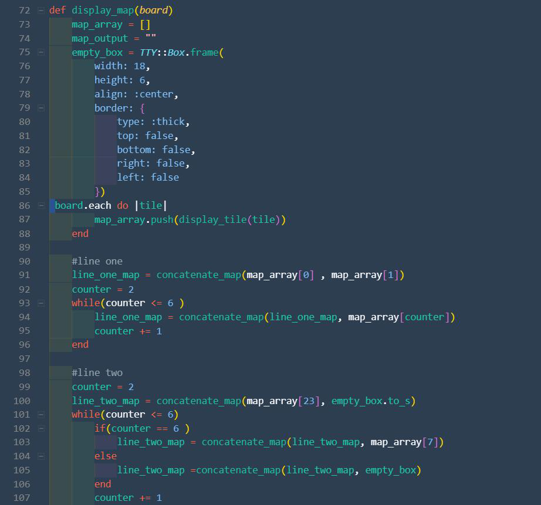

# Brandon and Suki Projct

**Project name** : Monopoly_in_ruby

**Project purpose** : This game is made to implement the practice in building a ruby terminal app and get a better understanding                                       of class, method, loops, and application of ruby gem packages.  we create the Monopoly in ruby to use innovation skill to explore ruby and stimulate the game system.

**project link** : This is our projcet link [Click me please](.)

"""
darwin = Property.new("Darwin", 100, "DRW")
alice_spring = Property.new("Alice Spring", 120, "ASP")
stanley = Property.new("Stanley", 140, "STY")
freycinet_national_park = Property.new("Freycinet National Park", 160, "FNP")
hobart = Property.new("Hobart", 200, "HBT")
margaret_river = Property.new("Margaret River", 220, "MGR")
broome = Property.new("Broome", 240, "BRM")
esperance = Property.new("Esperance", 260, "ESP")
pilip_island = Property.new("Philip Island", 300, "PLI")
melbourne = Property.new("Melbourne", 320, "MLB")
canberra = Property.new("Canberra", 340, "CNB")
questacon = Property.new("Questacon", 360, "QTC")
kangaroo_island = Property.new("Kangaroo Island", 420, "KGR")
gold_coast = Property.new("Gold Coast", 440, "GCS")
white_sundays = Property.new("White Sundays", 460, "WHS")
sydney = Property.new("Sydney", 500, "SYD")"""

#create chance and community class object 
chance = Chance.new() 
community_chest = CommunityChest.new() 

start = Start.new() 
jail = Jail.new() 
pass_jail = Jail.new() 
free_parking = FreeParking.new() 

**Gmae board, Tile and Players Movement**

Tile is a basic and significant set up in our game, the game board is a circle made of tiles. There are 6 types of tile : Property, Start,Jail,Freeparking, chance and community chest. Each of them has different few functionalities in the game. when the player land on the particular tile. Something would happen to the player. 

every time a player land on the tiles, the tile would contain player on the display. 
 

**Game Setting**

this terminal app simulate a monoploy game of 4 player , at the start of the game, each player is given a certain amount of money of $2000 and a token, token represent the player body on the gameboard. then player must roll the dice and move their token. after that they forward the number of spaces as  rolled on the dice. after player have completed their play, the tokens remain on the spaces occupied and proceed from that point on the player's next turn.
    According to the space your token reahes, you may be entitled to buy real estate which is called property in our Monopoly_in_ruby, or be obliged to pay rent, draw a Chance or Community Chest card. " Go to Jain", etc """

#### Features in Monopoly_in_ruby

**Perchase Property:**

   If the player lands on an unowned property, the player may buy it for the price listed on that property's space. If they agree to buy it, they pay the Bank the amount shown on the property space and receives the deed for that property. If they refuse to buy the property for the amount stated on the deed, the property is auctioned. Bidding may start at any price, and all players may bid. The highest bidder wins the property and pays the Bank the amount bid and receives the property's title deed. Railroads and utilities are also considered properties.

**Property Rent**

   If the player lands on an unmortgaged property owned by another player, they pay rent to that person, as specified on the property's deed. It is the property owner's responsibility to demand rent, and they have until the beginning of the second following player's turn to do so.
   If the player lands on their own property, or on property which is owned by another player but currently mortgaged, nothing happens.

**Chance and Community Chest Feature**

   If the player lands on a Chance or Community Chest, the player takes a card from the top of the respective pack and performs the instruction given on the card.

**Jail System**

+ If the player lands on the Jail space, they are "Just Visiting". No penalty applies.
If the player lands on the Go to Jail square, they must move their token directly to Jail.

**Free Parking**

A player landing on this space can go anywhere he want to on the game board, there is no limit, for example he can fly to his property and upgrade his property, or go to a chance to test his luck. 

**Few systems that we need to do in future **

we haven't work on the go system which  they collect $200 when they pass GO, and either does the income tax system that collect the persentage system they earn each 10 turns, house selling system, hotel system, and stock system.who throw dice first system,mortgages system

#### Team Works
 we break down our project into tasks and we use trello to manage our tasks. we work togeter remotly and effiently thanks for the trello and github. We push and pull the files before we update it on our local and push it on the github after we make change on it.
 

