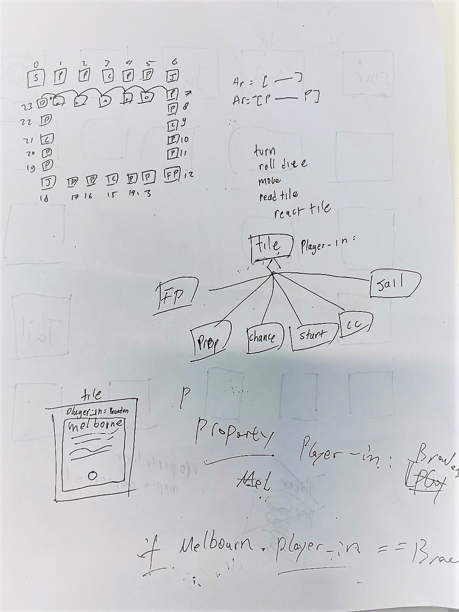

# Monopoly-terminal Project

**Project name** : Monopoly_in_ruby

**Project purpose** : This game is made to implement the practice in building a ruby terminal app and get a better understanding                                       of class, method, loops, and application of ruby gem packages.We create the Monopoly in ruby to use innovation skill to explore ruby and simulate the game system. I could use it for the maintainance and practical operation.

**Project link** : This is our project link [Click me please](https://github.com/sukibeww/monopoly-terminal/blob/master/monopoly.rb)

#### Project flow :

  

#### Timeline :

| Date |18/04/19|19/04/19|20/04/19|21/04/19|22/04/19|23/04/19|24/04/19|25/04/19|26/04/19|
| ----------- | ----------- | ----------- | ----------- | ----------- | ----------- | ----------- | ----------- | ----------- | ----------- |
| Brandon | Brain Storm | Project Planing | Player Class| Game Setting  | Chance feature | Community Feature | More_Game Features | Readme | Readme |
| Suki | Brain Storm | Project Planing | Jail Feature | GameBoard Displaye | Tile System | Tile System | Players Movement | Debug | Final Review |


### Game board, Tiles and Players Movement

Tile is a basic and significant element in our game, the game board is a circle made of tiles. Tile is like a block for player's token to land on. There are 6 types of tile : Property, Start, Jail, Freeparking, chance and community chest. Each of them has few different  functionalities in the game. when the player land on the particular tile. Something would happen to the player. 


##### Game board property tiles

```
board = [
    start,
    darwin,
    alice_spring,
    chance,
    stanley,
    freycinet_national_park,
    jail,
    hobart,
    margaret_river, 
    community_chest, 
    broome,
    esperance,
    free_parking,
    pilip_island,
    melbourne,
    chance_2, 
    canberra,
    questacon,
    pass_jail,
    kangaroo_island,
    gold_coast,
    community_chest_2,
    white_sundays,
    sydney]
    
# create chance and community class object 

chance = Chance.new() 
community_chest = CommunityChest.new() 
start = Start.new() 
jail = Jail.new() 
pass_jail = Jail.new() 
free_parking = FreeParking.new() 
```
##### GameBoard Display


##### Tiles Build 

```
def display_tile(tile)
    #determine the type of the object 
    if(tile.is_a?(Property))
        if(tile.owner == nil)
            temp_id = "No owner"
        else 
            temp_id = tile.owner.id 
        end 
        box = TTY::Box.frame(
            width: 18,
            height: 6,
            align: :center) do
                """#{tile.id}
tier:#{tile.tier}
owner: #{temp_id}
#{tile.in?()}
                """
            end 
```
##### When a player land on the tiles, the tile would contain player on the display. eg. line 1

```
board.each do |tile| 
        map_array.push(display_tile(tile))
    end 

    #line one 
    line_one_map = concatenate_map(map_array[0] , map_array[1])
    counter = 2 
    while(counter <= 6 )
        line_one_map = concatenate_map(line_one_map, map_array[counter])
        counter += 1 
    end 
```
### Game Setting

Monopoly_in_ruby simulate a monopoly game of 4 player , at the start of the game, each player is given a certain amount of money of $2000 and a token, token represent the player body on the gameboard. then player must roll the dice and move their token. after that they forward the number of spaces as  rolled on the dice. after player have completed their play, the tokens remain on the spaces occupied and proceed from that point on the player's next turn.
    According to the space your token reaches, you may be entitled to buy real estate which is called property in our Monopoly_in_ruby, or be obliged to pay rent, draw a Chance or Community Chest card. " Go to Jain", etc.
    
##### Name of each player is created and each player is given a certain amount of money
```
player1 = Player.new("suki")
player2 = Player.new("brandon")
player3 = Player.new("richard")
player4 = Player.new("michael") 
player_list = [player1, player2, player3, player4]

class Player
    attr_reader :name, :id
    attr_accessor :money, :property, :jail_status, :location, :bankrupt, :jail_time

    @@player_counter = 0
    def initialize(name)
        @@player_counter += 1
        @name = name
        @money = 2000
        @property = {}
        @jail_status = false
        @jail_time = 0
        @location = 0
        @id = "P#{@@player_counter.to_s()}"
        @bankrupt = false
    end
```
    
##### Player movement setting
```

def game(player_list, board) 
    current_player = player_list
    #set initial location 
    current_player.each do |player|
        board[0].move_in(player) 
    end 
    display_map(board)
    while(current_player.length > 1) 
        current_player.each do |player|
            player.player_stat() 
            if(player.jail_status == false)
                origin = player.location
                player.toss_dice() 
                destination = player.location 
                board[destination].move_in(player)
                player.location = destination 
                board[destination].tile_reader(player)
                board[origin].move_out(player)
                display_map(board)
            else
                player.bribe?() 
            end 
        end 
    end 
    puts "#{current_player[0]} is the winner ! "
end 

def concatenate_map(current_display, next_tile)
    current_display_lines = current_display.lines 
    next_tile_lines = next_tile.lines
    return current_display_lines.each_with_object('') { |line, str| str << line.chomp << next_tile_lines.shift }
end 

game(player_list, board) 
```
### Features in Monopoly_in_ruby

#### Property:

   If the player lands on an unowned property, the player may buy it for the price listed on that property's space. If they agree to buy it, they pay the Bank the amount shown on the property space and receives the deed for that property. If they refuse to buy the property for the amount stated on the deed, the property is auctioned. Bidding may start at any price, and all players may bid. The highest bidder wins the property and pays the Bank the amount bid and receives the property's title deed. Railroads and utilities are also considered properties.
   ##### Property names , Abbreviation and Cost
```
darwin = Property.new("Darwin", 100, "DRW")
alice_spring = Property.new("Alice Spring", 120, "ASP")
stanley = Property.new("Stanley", 140, "STY")
freycinet_national_park = Property.new("Freycinet National Park", 160, "FNP")
hobart = Property.new("Hobart", 200, "HBT")
margaret_river = Property.new("Margaret River", 220, "MGR")
broome = Property.new("Broome", 240, "BRM")
esperance = Property.new("Esperance", 260, "ESP")
pilip_island = Property.new("Philip Island", 300, "PLI")
melbourne = Property.new("Melbourne", 320, "MLB")
canberra = Property.new("Canberra", 340, "CNB")
questacon = Property.new("Questacon", 360, "QTC")
kangaroo_island = Property.new("Kangaroo Island", 420, "KGR")
gold_coast = Property.new("Gold Coast", 440, "GCS")
white_sundays = Property.new("White Sundays", 460, "WHS")
sydney = Property.new("Sydney", 500, "SYD")
```
##### Property Perchase

```
ef property_menu(property, player)
    prompt = TTY::Prompt.new
    puts "You arrived at #{property.name}" 
    if(property.owner == player)  
        puts "Current property tier: #{property.tier}"
        response = prompt.select("Do you want to upgrade your property?", %w(Yes No))
        if(response == "Yes") 
            property.upgrade(player)
        else 
            puts "Enjoy your stay" 
        end 
    elsif(property.owner == nil)
        puts "Nobody own a property in #{property.name} do you want to buy it?"
        response = prompt.select("Do you want to purchase a property in #{property.name}? for #{property.buy_cost}?", %w(Yes No))
        if(response == "Yes") 
            player.buy_property(property)
        else 
            puts "See you next time" 
        end 
    else 
        player.rent(property)
    end 
end 
```
##### Property Rent

   If the player lands on an unmortgaged property owned by another player, they pay rent to that person, as specified on the property's deed. It is the property owner's responsibility to demand rent, and they have until the beginning of the second following player's turn to do so.
   If the player lands on their own property, or on property which is owned by another player but currently mortgaged, nothing happens.

```
def rent(property)
        prompt = TTY::Prompt.new()
        if(@money >= property.rent)
            prompt.select("Property owned by #{property.owner.name},
            the rent cost #{property.rent}", %w(Pay))
            @money -= property.rent
            property.owner.money += property.rent
        else
            prompt.select("You do not have enough money.", %w(Bankrupt))
            @bankrupt = true
        end
    end
```
#### Chance and Community Chest Feature

   If the player lands on a Chance or Community Chest, the player takes a card from the top of the respective pack and performs the instruction given on the card.
   
 ##### Chance  
```
class Chance < Tile
    attr_accessor :random_chance, :board
    def initialize
        super()
        @random_chance = 0
        @board = []
    end

    def draw()
        @random_chance = rand(1..5)
    end

    def read(player)
        case draw()
        when 1
            chance_1(player)
        when 2
            chance_2(player)
        when 3
            chance_3(player)
        when 4
            chance_4(player)
        when 5
            chance_5(player)
        end
    end

    def chance_1(player)
        prompt = TTY::Prompt.new()
        prompt.select("BUSTED! You are in jail now !", %w(Jailed))
        board[player.location].move_out(player)
        player.location = 6
        board[player.location].move_in(player)
        board[player.location].tile_reader(player)
    end

    def chance_2(player)
        prompt = TTY::Prompt.new()
        prompt.select("Move forward up to 5 spaces", %w(Whoosh!))
        board[player.location].move_out(player)
        player.location += 5
        board[player.location].move_in(player)
        board[player.location].tile_reader(player)
    end

    def chance_3(player)
        prompt = TTY::Prompt.new()
        prompt.select("Make general repairs on all your property–For each house pay $25", %w(Pay))
        maintenance_cost = player.property.length * 50
        if (player.money >= maintenance_cost)
            player.money -= maintenance_cost
        else
            puts "You don't have enough money"
            player.bankrupt = true
        end
    end

    def chance_4(player)
        prompt = TTY::Prompt.new()
        prompt.select("Vacation to Sydney", %w(Whoosh!))
        board[player.location].move_out(player)
        player.location = 23
        board[player.location].move_in(player)
        board[player.location].tile_reader(player)
    end

    def chance_5(player)
        prompt = TTY::Prompt.new()
        prompt.select("To free parking", %w(Whoosh!))
        board[player.location].move_out(player)
        player.location = 12
        board[player.location].move_in(player)
        board[player.location].tile_reader(player)
    end
end
```
##### Community_Chest
```
class CommunityChest < Tile

    def initialize
        super()
        @random_community_chest = 0
    end

    def draw()
        @random_community_chest = rand(1..5)
    end

    def read(player)
        @random_community_chest = draw()
        case @random_community_chest
        when 1
            community_chest_1(player)
        when 2
            community_chest_2(player)
        when 3
            community_chest_3(player)
        when 4
            community_chest_4(player)
        when 5
            community_chest_5(player)
        end
    end

    def community_chest_1(player)
        prompt = TTY::Prompt.new()
        prompt.select("Bank pays you dividend of $50", %w(Collect))
        player.money += 50
    end

    def community_chest_2(player)
        prompt = TTY::Prompt.new()
        if(player.money >= 200)
            prompt.select("Doctor's fees – Pay $200", %w(Pay))
            player.money -= 200
        else
            puts "Not enough money"
            player.bankrupt = true
        end
    end

    def community_chest_3(player)
        prompt = TTY::Prompt.new()
        prompt.select("It is your birthday Collect $200", %w(Collect))
        player.money += 50
    end

    def community_chest_4(player)
        prompt = TTY::Prompt.new()
        if(player.money >= 120)
            prompt.select("Pay School Fees of $120", %w(Pay))
            player.money -= 120
        else
            puts "Not enough money"
            player.bankrupt = true
        end
    end

    def community_chest_5(player)
        prompt = TTY::Prompt.new()
        number_of_property = player.property.length
        total_cost = 80 * number_of_property
        if(player.money >= total_cost)
            prompt.select("You are assessed for street repairs – $80 per property", %w(Pay))
            player.money -= number_of_property * 60
        else
            puts "Not enough money"
            player.bankrupt = true
        end
    end
end
```

#### Jail 

If the player lands on the Jail space, they are "Just Visiting". No penalty applies.
If the player lands on the Go to Jail square, they must move their token directly to Jail.
```
class Jail < Tile
    attr_accessor :player_in_jail, :board
    def initialize()
        super()
        @player_in_jail = {}
        @board = []
    end

    def check_index(player)
        puts "Player location : #{player.location}"
        case player.location
        when 6
            board[player.location].move_out(player)
            player.go_to_jail()
            puts "Player location2 : #{player.location}"
            board[player.location].move_in(player)
            update_jail(player)
            player.player_stat()
        when 18
            pass_by_jail()
        end
        return player
    end

    def update_jail(player)
        player_name_sym = player.name.to_sym()
        player_hash = {
            "#{player_name_sym}": player
        }
        @player_in_jail.merge!(player_hash)
    end

    def pass_by_jail()
        puts "Passing by Jail"
    end
end
```

#### Brible

If the player is in jails, he could be bailed out if he is willing to pay a certain amount of money.

```
def bribe?
        prompt = TTY::Prompt.new()
        if(@money > 300 && @jail_time >= 1)
            player_input = prompt.select("Do you want to bribe your way out of jail? ($300)", %w(Yes No))
            case player_input
            when "Yes"
                @money -= 300
                @jail_time = 0
                @jail_status = false
                @location = 18
                puts "You are free!"
            when "No"
           
                puts "You lose a turn"
                @jail_time -= 1
            end
        end
    end
```

#### Free Parking

A player landing on this space can go anywhere he want to on the game board, there is no limit, for example he can fly to his property and upgrade his property, or go to a chance to test his luck. 

```
class FreeParking < Tile
    attr_accessor :board
    def initialize()
        super()
        @board = []
    end


    def free_parking(player)
        prompt = TTY::Prompt.new()
        user_choice = prompt.select("Where do you want to park?") do |menu|
            menu.choice name: "Start", value: 0
            menu.choice name: "Darwin", value: 1
            menu.choice name: "Alice Spring", value: 2
            menu.choice name: "Chance", value: 3
            menu.choice name: "Stanley", value: 4
            menu.choice name: "Freycinet National Park", value: 5
            menu.choice name: "Jail", value: 6
            menu.choice name: "Hobart", value: 7
            menu.choice name: "Margaret River", value: 8
            menu.choice name: "Community Chest", value: 9
            menu.choice name: "Broome", value: 10
            menu.choice name: "Esperance", value: 11
            menu.choice name: "Free Parking", value: 12, disabled:("You are here")
            menu.choice name: "Pilip Island", value: 13
            menu.choice name: "Melbourne", value: 14
            menu.choice name: "Chance_2", value: 15
            menu.choice name: "Canberra", value: 16
            menu.choice name: "Questacon", value: 17
            menu.choice name: "Pass by Jail", value: 18
            menu.choice name: "Kangaroo Island", value: 19
            menu.choice name: "Gold Coast", value: 20
            menu.choice name: "Community Chest_2", value: 21
            menu.choice name: "White Sundays", value: 22
            menu.choice name: "Sydney", value: 23
        end
        board[player.location].move_out(player)
        player.location = user_choice
        board[player.location].move_in(player)
        board[player.location].tile_reader(player)
    end
end
```

**Future enhancements**

We haven't work on the go system which  they collect $200 when they pass GO, and either does the income tax system that collect the percentage system they earn each 10 turns, house selling system, hotel system, and stock system. who throw dice first system, mortgages system

#### Team Works
 We break down our project into tasks and we use trello to manage our tasks. we work togeter remotly and effiently thanks for the trello and github. We push and pull the files before we update it on our local and push it on the github after we make change on it.
 


#### Evidence of app idea brainstorming session

#### User stories

   As a player,I want to roll the dice, so that I can move around the game board. As a player, I want to see the board to track the game flow. As a player,I want to buy a property off the board to invest my in-game money to win the game. As a player,I want to upgrade my property in order to invest more in promising property. As aplayer,I want to be able bribe my way out of the jail, in which way I could be freedom and have chance to win the game. As aplayer,I want to be able to choose which tiles to go when I land on Free Parking. So that there will be more control in the game and less randomization.

   
#### Potential legal, moral, ethical, cultural and safety issues

we had a concern regarding the offence to the monopoly board game patent. Certainly monopoly is trademarked because it is a comercial product, some of the game mechanics is patented. And art of the game board and cards are protected by copyright. But I think I would be OK because this terminal app is local and also it's not used for profit, we just use to techical learning and practice. Plus our game is not 100% same to the origninal monopoly game. We are making our own art. So we think we can just get away from too much concern about it.
   ___
   
 * Description of the app
- [x] Project Purpose
- [x] Project Functionality
- [x] Screenshots
- [x] Future enhancements
- [x] Potential legal, moral, ethical, cultural and safety issues

 * Details of design & planning process
- [x] Evidence of app idea brainstorming session
- [x] User stories
- [x] Project plan & timeline
- [x] Description of overall app design (classes, files, basic flow)
- [x] Screenshots of Trello board

Thanks for Watching !
 


